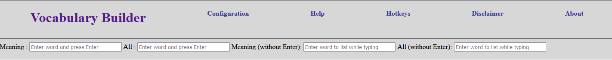

# Vocabulary Builder
Vocabulary Builder is an application that can be used to for learning arcane vocabulary words for competitive language exams. 
It has been designed in a way that you can work with as few clicks and typing as possible. 

## Features
1. Show results dynamically (without having to press Return/Enter key after each entry).
2. Shows search results from [Google](https://www.google.com/)  , [Merriam Webster](https://www.merriam-webster.com/), [Google Images](https://www.google.com/imghp), [YouTube](https://www.youtube.com/), and [Olam](https://olam.in/) in new tabs.  

## TechStack
- JavaScript with HTML and CSS is used for front-end.
- [PHP](https://www.php.net/) has been used as back-end.
- [MongoDB](https://www.mongodb.com/)is the database used in current version. Previous it was [MySQL](https://www.mysql.com/).
- [Docker](https://www.docker.com/) has been used for portability.

## Running the Project

#### Prerequisites for running:
1. [MongoDB](https://www.mongodb.com/)
2. [Docker](https://www.docker.com/)

#### Steps
1. Ensure MongoDB is running `localhost` in `port: 27017`.
2. Build and run a  image from the  Dockerfile in the root directory.
    `docker run -p 80:80 -d vocabularyBuilder`
3. Access the project from: http://localhost:80

#### MongoDB Structure
Database name must be 'VocabularyBuilder' and collections name must be 'all_words'.
If you are using different names, kindly update in the file `php/vocabularyAppWebServer.php`

### Version History
#### v.1
    Development started on 22-March-2020 IST.
    Development completed on at 23:23 on 29-March-2020 IST.

#### v.2

    Redesign started 10:000 17-October-2023 PT
    Deployed to cloud around 12:00 of 18-October-2023 PT.

## Disclaimer 
While developing and using the application I had used study proprietary materials of other companies, to comply with copyright laws and their works I have excluded them from the deployed database.